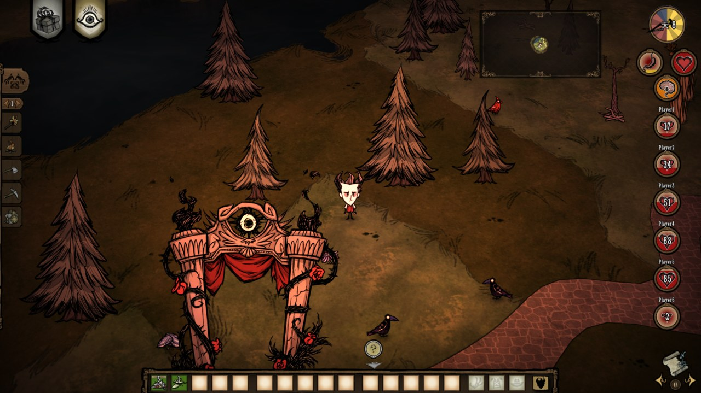

# PartyHud 2026

A modernized fork of [PartyHUD](https://github.com/brianchenito/PartyHud) by **brianchenito** — shows every teammate's status right on your HUD: health, hunger, sanity, on-fire and temperature, updated to work on current *Don't Starve Together*.

- **Source:** https://github.com/iblislin/DST-PartyHud
- **Steam Workshop:** https://steamcommunity.com/sharedfiles/filedetails/?id=3744675705



## What's new in 2026
- Works on current DST (the original was last updated in 2016)
- Fixed a dedicated-server crash that triggered when a player disconnected, and the cave-entry / shard-migration crashes
- Fixed the invisible health badge (re-ported to the current `Badge` widget; build `health` → `status_health`)
- New **Vertical** layout, plus the classic **Horizontal** row
- Layout & position are now **per-player** settings (`client = true`)
- Minimap-friendly position presets; vertical anchor follows the position setting

### New in 2026.6 — richer status
- Each badge now shows a teammate's **hunger** and **sanity** as small sub-rings beneath the main **HP** ring
- All numbers are the **absolute in-game values** (e.g. `113`, not a 0–100 percent), matching the game's own meters; hover a sub-ring to read its number
- **On fire / overheating / freezing** show as a colour-coded warning pulse on the HP ring (orange / red / cyan)
- A **sanity rate arrow** mirrors the game's own gauge — rising/falling at three speeds
- Vertical layout **auto-wraps into columns** sized to your screen height, re-flows when you resize the window, and keeps clear of the map (M) button
- Two new per-player options: **Show Your Own Badge** and **Hunger/Sanity Sub-gauges** (hide them for a compact HP-only badge)

## Install (server mod)
Subscribe on the Workshop, **or** place this folder into your server's `mods/` as `partyhud` and enable it in each shard's `modoverrides.lua`:
```lua
["partyhud"] = { enabled = true }
```
Connecting players download it automatically. _(If you grab a GitHub source archive, rename the extracted folder to `partyhud`.)_

## Settings (each player chooses their own)
- **HUD Layout:** Horizontal / Vertical
- **HUD Position:** Minimap / Minimap XL / Standard
- **Show Your Own Badge:** Show / Skip (skip it — you already have your own status meters)
- **Hunger/Sanity Sub-gauges:** Show / Hide (hide for a compact HP-only badge)

## Credits & License
Original PartyHUD by **brianchenito**, released into the public domain under [The Unlicense](LICENSE). Attribution is not required, but kept here with thanks for the original work.

---

## Steam Workshop description — English (copy-paste, Steam BBCode)

```
[b]PartyHud 2026[/b]

See your teammates' status right on your HUD — a badge for each player showing
their name, current HP, hunger and sanity, plus on-fire and temperature warnings,
so you always know who needs help.

A community update of the classic [b]PartyHUD[/b] by brianchenito, modernized
to work on current Don't Starve Together builds.

[b]What's new[/b]
[list]
[*] Works on current DST (the original was last updated in 2016)
[*] Fixed the dedicated-server disconnect crash and the cave-entry / shard crashes
[*] Fixed the health badge not showing (re-ported to the current badge UI)
[*] New [b]Vertical[/b] layout, plus the classic [b]Horizontal[/b] row
[*] Layout & position are now [b]per-player[/b] settings (Mods -> PartyHud 2026 -> Configure)
[*] Minimap-friendly position presets (Minimap / Minimap XL / Standard)
[/list]

[b]New in 2026.6 — richer status[/b]
[list]
[*] Hunger and sanity sub-rings beneath each HP ring; numbers are the real in-game
    values (hover a sub-ring to read it)
[*] On-fire / overheating / freezing shown as a colour-coded pulse on the HP ring
[*] A sanity rate arrow (rising/falling), mirroring the game's own gauge
[*] Vertical layout auto-wraps into columns to fit your screen and avoid the map button
[*] New options: Show Your Own Badge, and Hunger/Sanity Sub-gauges (hide for a compact badge)
[/list]

[b]Settings (each player picks their own)[/b]
[list]
[*] HUD Layout: Horizontal / Vertical
[*] HUD Position: Minimap / Minimap XL / Standard
[*] Show Your Own Badge: Show / Skip
[*] Hunger/Sanity Sub-gauges: Show / Hide
[/list]

[b]Note[/b] — this is a server mod: install it on your dedicated server (or enable
when hosting) and connecting players download it automatically.

[b]Source[/b]: https://github.com/iblislin/DST-PartyHud
Original PartyHUD by brianchenito, released into the public domain (Unlicense).
Thanks for the original work!
```

## Steam Workshop 說明 — 繁體中文(可直接複製,Steam BBCode)

```
[b]PartyHud 2026[/b]

直接在 HUD 上看到隊友的狀態 —— 每位玩家一個徽章,顯示名字、目前 HP、
飢餓與理智,並提示著火與溫度(過熱/失溫),隨時掌握誰快不行了。

這是經典 mod [b]PartyHUD[/b](原作者 brianchenito)的社群更新版,
重新移植以支援現版的 Don't Starve Together。

[b]更新內容[/b]
[list]
[*] 支援現版 DST(原版自 2016 年後未更新)
[*] 修正玩家離線造成的專用伺服器 crash,以及進洞穴 / shard 遷移的 crash
[*] 修正血條不顯示的問題(重新對接現版 badge UI)
[*] 新增[b]垂直[/b]排列,並保留經典的[b]水平[/b]排列
[*] 排列與位置改為[b]每位玩家可自訂[/b](Mods -> PartyHud 2026 -> Configure)
[*] 相容 minimap mod 的位置預設(Minimap / Minimap XL / Standard)
[/list]

[b]2026.6 新增 —— 更豐富的狀態[/b]
[list]
[*] 主 HP 環下方新增飢餓、理智小子環;數字為遊戲內真實絕對值(滑鼠移上去看數字)
[*] 著火 / 過熱 / 失溫以 HP 環上的顏色脈動提示(橘 / 紅 / 青)
[*] 理智速率箭頭(上升/下降),與遊戲原生條一致
[*] 垂直排列依螢幕高度自動換欄、視窗縮放會重排,並避開地圖(M)按鈕
[*] 新選項:顯示自己的徽章、飢餓/理智子環(可隱藏為精簡的純 HP 徽章)
[/list]

[b]設定(每位玩家各自選擇)[/b]
[list]
[*] HUD Layout(排列):Horizontal(水平)/ Vertical(垂直)
[*] HUD Position(位置):Minimap / Minimap XL / Standard
[*] Show Your Own Badge(顯示自己):Show / Skip
[*] Hunger/Sanity Sub-gauges(飢餓/理智子環):Show / Hide
[/list]

[b]注意[/b] —— 這是伺服器端 mod:安裝在你的專用伺服器(或開房時啟用),
連線的玩家會自動下載。

[b]原始碼[/b]:https://github.com/iblislin/DST-PartyHud
原版 PartyHUD 作者 brianchenito,已釋出至公有領域(Unlicense)。感謝原作!
```
